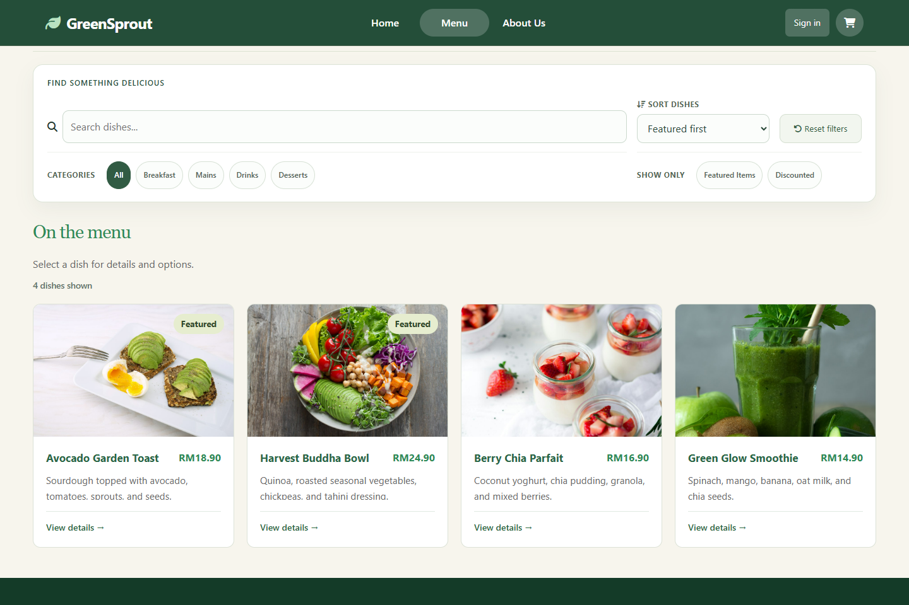
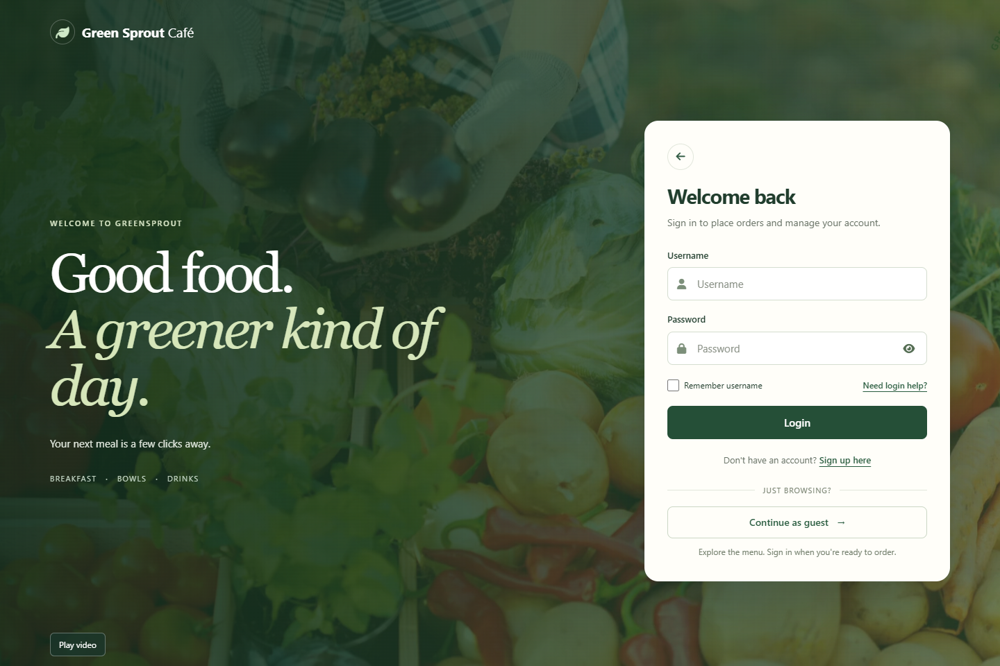
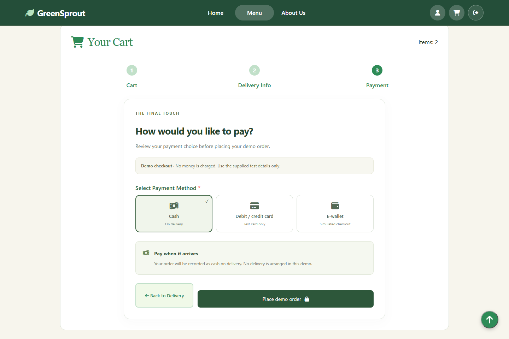
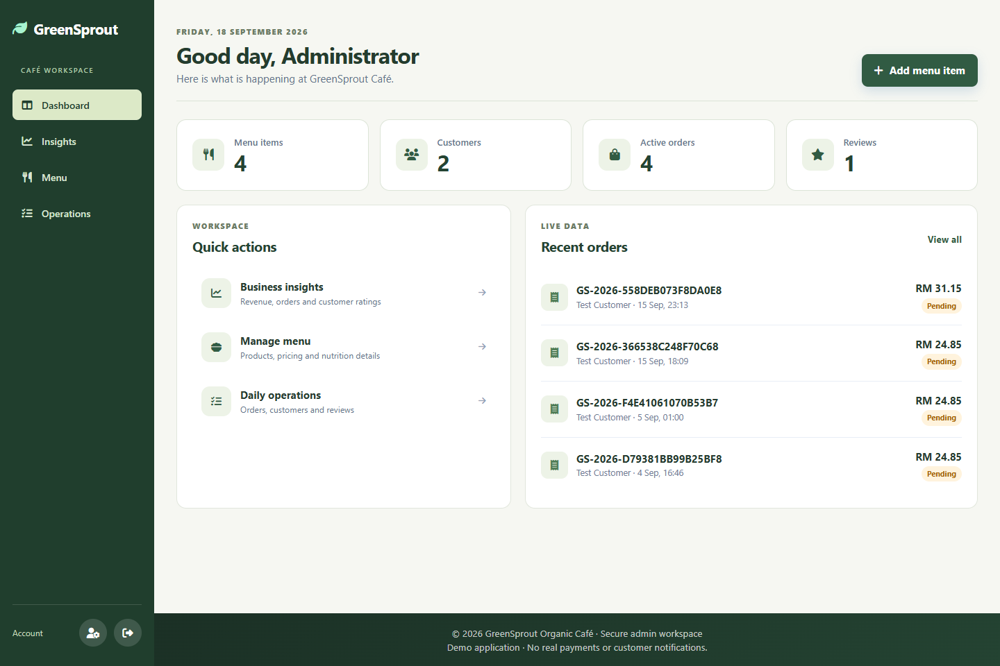
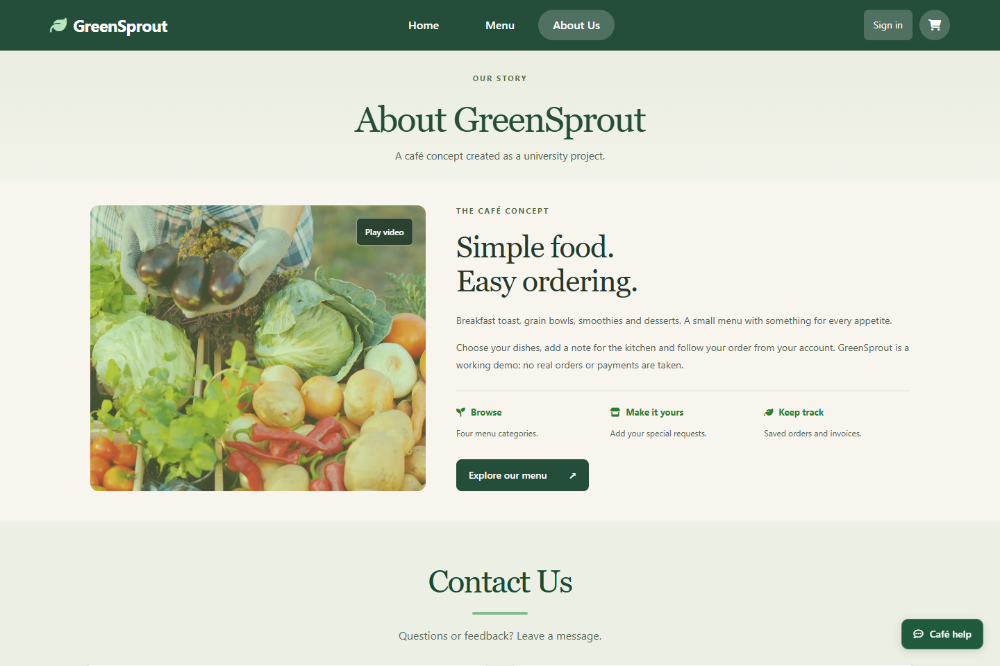
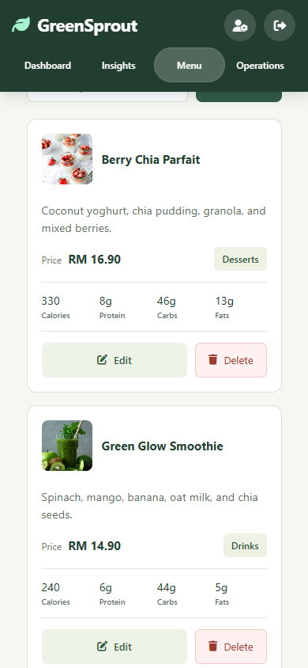

# GreenSprout Café

A café ordering website with a customer storefront and admin dashboard, built with PHP, MySQL and JavaScript.

[](https://github.com/kaiqingkhaw/greensprout-cafe/actions/workflows/checks.yml)

## Try it

This repository contains the source code; there is no hosted demo yet. View the [screenshots](#screenshots), or follow [Run locally](#run-locally) to try the customer and administrator accounts on your computer.

Both roles use the same login page. Customer accounts open the storefront; administrator accounts open the dashboard. No shared login credentials are published.

## Features

- Customer registration, login and profile editing
- Menu search, category filters, cart and special requests
- Demo checkout, saved invoices and order status
- Admin product, customer, order and review management
- Sales summaries and CSV exports

## Source code

| Folder | Contents |
| --- | --- |
| [public/](public/) | HTML pages and PHP request handlers |
| [public/assets/css/](public/assets/css/) | Stylesheets |
| [public/assets/js/](public/assets/js/) | Frontend JavaScript |
| [app/](app/) | Database connection, session helpers and shared PHP code |
| [database/](database/) | MySQL schema and starter menu |
| [scripts/](scripts/) | Admin account creation and database migration |
| [tests/](tests/) | Automated tests |

Start with [the menu page](public/menu.html), [checkout handler](public/create_order.php) or [admin dashboard](public/admin_home.php). [Architecture notes](docs/ARCHITECTURE.md) explain how they fit together.

## Screenshots

### Menu



| Login | Checkout |
| --- | --- |
| [](docs/screenshots/login.png) | [](docs/screenshots/checkout.png) |

### Admin dashboard



<table>
  <tr><th width="65%">About</th><th width="35%">Mobile admin</th></tr>
  <tr>
    <td align="center"><a href="docs/screenshots/about.png"></a></td>
    <td align="center"><a href="docs/screenshots/admin-mobile.png"></a></td>
  </tr>
</table>

## Run locally

Requires PHP 8.1+, MySQL/MariaDB, and the PHP `mysqli`, `mbstring` and `fileinfo` extensions. Tested using XAMPP with PHP 8.2.4.

1. Download this repository using **Code → Download ZIP**, extract it, and copy the project into `C:/xampp/htdocs/GreenSproutCafe-Portfolio`.
2. Start Apache and MySQL in XAMPP.
3. For a new installation, import `database/schema.sql` through phpMyAdmin.
4. Open [localhost/GreenSproutCafe-Portfolio](http://localhost/GreenSproutCafe-Portfolio/).
5. Register a customer through the Sign up page.

To create an administrator, run this from the project folder:

```powershell
C:/xampp/php/php.exe scripts/create_admin.php your_admin admin@example.com "YOUR_UNIQUE_PASSWORD"
```

Use a password of at least 12 characters. Account passwords are not included in this repository.

Database defaults work with a standard local XAMPP setup. For other environments, configure the server variables listed in [.env.example](.env.example). The app does not automatically read `.env` files.

For an existing installation, back up the database and run `C:/xampp/php/php.exe scripts/migrate.php` instead of importing the starter schema again. For deployment, point the web server at `public/`. PHP and MySQL are required; GitHub Pages cannot run the backend.

## Try both roles locally

After completing the setup above:

| Role | How to sign in | What to try |
| --- | --- | --- |
| Customer | Open **Sign up**, create an account, then log in with its username and password. | Filter dishes, add items to the cart, enter a Kuala Lumpur delivery address, place a demo order and open its invoice. |
| Administrator | Run the admin-creation command above with your own username and password, then enter them on the same login page. | Edit a menu item, find the customer's order in **Operations**, change its status, view **Insights** and export a CSV. |

To see the full flow, place an order as a customer, sign out, update that order as an administrator, then sign back in as the customer and check its tracking page. Use sample contact details; no payment or delivery takes place.

## Tests

With Node.js 22+ and PHP available:

```sh
npm test
php tests/product-media.php
```

With the local Apache/MySQL installation running:

```powershell
$env:ALLOW_TEST_WRITES = "1"
npm run test:http
npm run test:structure
```

The HTTP suite creates temporary test records and removes them afterward. GitHub Actions runs frontend tests and PHP checks on every push.

## Limitations

Payments are simulated, tracking shows saved order status rather than GPS, and contact messages are stored without sending email. Password-reset email is not implemented. Profile photos and database credentials stay outside Git.

## Credits

The original application was developed as a group assignment. My later revision covers the interface redesign, feature improvements, validation, tests and repository organisation.

Food photos: [Unsplash sources](public/assets/images/CREDITS.md). Icons: [Font Awesome Free license](public/assets/vendor/fontawesome/LICENSE.txt). Café videos and the logo are from the original university project.
